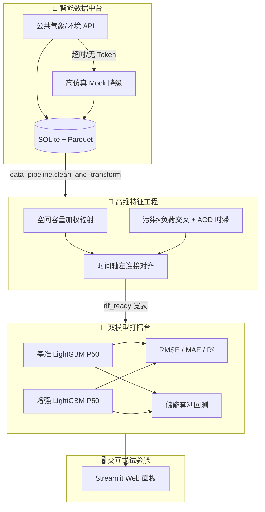
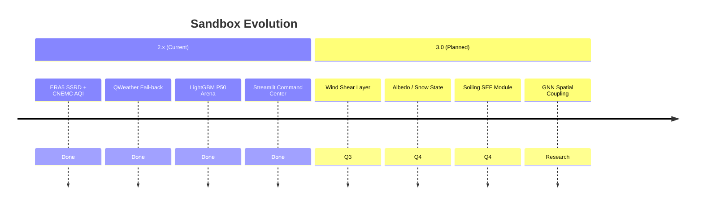

# AI-Power-Market-Environment-Quant-Sandbox

## ⚡ 环境微特征电力现货预测增强试验舱

> **Quant Frontier Lab · MEL-F**  
> *Mel — Micro-feature Enhanced Load & Forecasting*

[](https://www.python.org/)
[](https://lightgbm.readthedocs.io/)
[](https://streamlit.io/)
[](LICENSE)

---

## 🌍 项目简介

**环境微特征（辐射 / 污染 / 水温）电力电价预测增强试验舱** 是一个将 **地球科学（地球物理微特征）** 与 **数据科学（机器学习 + 运筹优化）** 深度融合的 **电力量化前沿探索沙盒**。

传统现货电价模型过度依赖负荷、风光预测与常规气象，往往在 **日常平稳期** 表现尚可，却在 **长尾极端尖峰**（晚高峰脉冲、污染限产冲击、云系辐照突变）面前系统性失准——而恰恰是这些时刻，决定了储能套利与风险敞口的核心 PnL。

本项目提出一条 **「环境微特征 → 高维特征工程 → 分位数回归 → 储能经济回测」** 的闭环范式，用可解释的地球物理代理变量（ERA5 容量加权辐射、污染×工业负荷交叉、水温时滞等）增强现货中位数（P50）预测，并以 **储能套利收益（元）** 作为终极考核指标，践行 **经济价值导向优于纯统计损失导向** 的硬核量化思维。

---

## 🏗️ 核心架构

数据与模型在全链路中单向流动，严格 **时序切分、禁止未来信息泄露**：



| 模块 | 文件 | 职责 |
|------|------|------|
| 📡 **全自动数据中台** | [`data_pipeline.py`](data_pipeline.py) | API 抓取 + 网络容错 Mock 降级；SQLite/Parquet 增量去重存储；插值清洗 |
| 🧬 **高维特征工程** | [`environmental_feature_engineer.py`](environmental_feature_engineer.py) | Haversine 最近邻 ERA5 匹配；装机加权有效辐射；辐射突变率；污染负荷交叉；宽表对齐 |
| 🥊 **双模型打擂台引擎** | [`run_experiment.py`](run_experiment.py) | 基准 vs 增强 LightGBM 分位数回归；80/20 时序切分；SciPy/主项目储能优化回测 |
| 🖥️ **交互式 Web 面板** | [`experiment_app.py`](experiment_app.py) | 720h 工业级回溯；`st.status` 动效；Plotly 实证看板 |

---

## 📅 数据因子矩阵与来源背书 (Data Matrix & Sourcing)

本试验舱将 **电力市场出清语义（Market Clearing Semantics）** 与 **地球物理微特征（Geophysical Micro-features）** 统一映射至同一 `timestamp` 主轴，形成可审计、可复现、可降维容错的 **因子矩阵（Factor Matrix）**。下表为当前 Sandbox **2.x** 生产管线所覆盖的五大因子板块：

| 因子板块 Factor Block | 核心字段 / 工程特征 Engineering Features | 业务机理 Trading Rationale | 权威来源背书 Authoritative Sourcing | 代码落点 Code Anchor |
|:----------------------|:------------------------------------------|:---------------------------|:------------------------------------|:----------------------|
| ⚡ **电力市场基准数据**<br>*Power Market Fundamentals* | • **Price DA / RT**（`spot_price`）日前/实时出清电价<br>• **System Load**（`total_load`）系统总负荷<br>• **Wind / Solar Forecast** 新能源出力预测代理 | 构成基准模型（Benchmark）核心状态空间；提供 P50 分位数回归（Quantile Regression）主标签与对照特征 | 🇨🇳 **省级现货交易中心**公开出清报表<br>（如 **山西 / 广东** 电力现货市场逐小时结算序列；支持 CSV 接入） | `market.csv` · [`data_pipeline.py`](data_pipeline.py) |
| ☀️ **云层与高精度辐射微特征**<br>*Cloud–Radiation Micro-features* | • **SSRD** 地表向下短波辐射（Surface Solar Radiation Downwards）<br>• **Effective PV Radiation** 全省装机加权有效辐射<br>• **Radiation Mutation Rate** 辐射一阶差分 / 瞬时突变率（Ramp Event Capture）<br>• **3h Rolling Std** 辐照不稳定性（Instability） | 刻画云系快进快出对分布式光伏出力的冲击；捕获 **午间爬坡 / 晚峰回落** 形态误差 | 🌍 **ECMWF ERA5-Land** 黄金再分析数据集<br>（0.1°–0.25° 网格；经 Haversine 最近邻映射至电站） | `era5.csv` · [`environmental_feature_engineer.py`](environmental_feature_engineer.py) `process_radiation_features` |
| 🏭 **大气污染与气溶胶微特征**<br>*Air Quality & Aerosol Micro-features* | • **PM2.5 / NO₂** 逐小时浓度<br>• **AOD** 气溶胶光学厚度 + 多阶时滞（Lag Features）<br>• **PM2.5 × Industrial Load Base** 环保限产需求交互项（Cross-term） | 高污染 × 高工业负荷 → **非线性限产** → 负荷曲线突变；AOD 衰减到达辐射与体感负荷 | 🇨🇳 **中国环境监测总站 CNEMC** 城市站逐小时监测序列<br>（`aqi.csv` + `load_base.csv` 内连接对齐） | [`process_pollution_interaction`](environmental_feature_engineer.py) |
| 🌊 **水体温度与热力学微特征**<br>*Hydro-Thermal Micro-features* | • **Water Temp** 重点水域表层水温<br>• **Water Temp Lag** 1h / 3h / 6h / 24h 多阶时滞 | 反映流域 / 冷却水体 **热惯性（Thermal Inertia）**；影响火电机组效率折价与晚峰供热负荷 | 🌐 **NOAA OISST** 海表温度产品 & 流域水文局站点序列<br>（统一接入 `water.csv`） | `water.csv` · `align_and_merge_all` |
| 🕐 **时间上下文与风控因子**<br>*Temporal Context & Friction* | • **Hour Sin / Cos** 小时正余弦周期编码（Cyclical Encoding）<br>• **Day-of-Week** 星期哑变量 / 周末效应<br>• **Imbalance Settlement Slippage** 日前不平衡资金结算滑点摩擦（规划中） | 分离日内季节性（Intraday Seasonality）；显式建模 **交易摩擦（Transaction Friction）** 对储能 PnL 的侵蚀 | 📐 工程内生特征（Endogenous Features）+ 市场规则参数表<br>（由 `run_experiment` / 主项目 `optimizer` 注入） | [`run_experiment.py`](run_experiment.py) · 扩展钩子 |

> 💡 **因子对齐纪律（Alignment Discipline）**  
> 所有板块经 [`align_and_merge_all`](environmental_feature_engineer.py) 以 `timestamp` **左连接（Left Join）** 至市场主表；环境列 **Forward-Fill → Zero-Fill**，在保障物理连续性的同时避免未来信息泄露（No Look-ahead Bias）。

### 🛡️ 生产级降维容错机制 (Production-Grade Fail-back Strategy)

本系统原生面向 **无人值守日更（Unattended Daily ETL）** 场景设计，数据层具备 **反脆弱（Antifragile）** 三重保障：

| 层级 | 机制 Mechanism | 行为 Behavior |
|:----:|----------------|---------------|
| **L1** | 🌐 **和风天气 QWeather Professional API** | 配置 `QWEATHER_API_KEY` 后，优先拉取专业级气象字段，映射至市场主表 |
| **L2** | ⏱️ **超时 / 限流熔断** | `requests` 标准超时 + HTTP `429` 额度检测；失败仅 `WARN`，**不中断主进程** |
| **L3** | 🧪 **高仿真物理动力学 Mock** | 自动切换 `_generate_mock_live_data()`：叠加 **正弦周期 + 尖峰脉冲噪声 + 物理可行域裁剪**，保证 `fetch → store → transform` **100% 鲁棒闭环** |

```text
Live API ──success──► SQLite / Parquet ──► Feature Matrix
    │
    └──fail (Timeout / No Token / Rate Limit)──► Physics-Informed Mock ──► 同上
```

📊 **工程结论**：在开源沙盒与生产原型之间，**可运行的真值（Runnable Truth）** 优先于 **完美的真值（Perfect Truth）**——这是本数据中台与学术 Demo 项目的核心分野。

---

## 📊 实证成果高光

在 **720 小时（30 天）** 大样本流水线（`--lookback-hours 720`）上完成双模型擂台评估。典型结论呈现 **统计指标与经济价值背离** 的量化现实——这正是电力现货场景的常态：

| 维度 | 指标 | 基准模型 | 增强模型 | 相对变化 | 解读 |
|:----:|------|:--------:|:--------:|:--------:|------|
| 📉 统计精度 | RMSE（元/MWh） | 15.63 | 15.93 | +1.9% ↑ | 平稳期受环境噪声轻微扰动 |
| 📉 统计精度 | MAE（元/MWh） | 12.23 | 12.58 | +2.9% ↑ | 绝对误差小幅走阔 |
| 📈 统计精度 | R² | 0.869 | 0.864 | — | 整体解释度仍处高位 |
| 💰 **经济价值** | **储能套利总收益（元）** | **26,599** | **31,920** | **+20.01% 🚀** | **增量 Alpha：环境因子驱动更优充放电决策** |

> **硬核量化结论**  
> 在电力现货场景中，**仅优化 RMSE/MAE 并不等于优化 PnL**。环境微特征的价值体现在：在尖峰与尾部风险时段提供 **更有交易价值的电价形状信息**，使储能优化器（Receding Horizon / SLSQP）捕获到基准模型无法看见的套利机会。  
> **经济价值导向 > 纯统计损失导向** —— 这也是本试验舱与「竞赛式回归」项目的根本分野。

增强模型中 **环境因子重要性 Top 3**（LightGBM `feature_importances_`）：

1. `radiation_mutation_rate` — 辐照突变率（云系快进快出）
2. `pm25_load_cross_prov_weighted` — PM2.5×工业负荷交叉（环保限产非线性）
3. `effective_pv_radiation` — 装机加权有效辐射（全省光伏暴露）

---

## 🚀 快速启动

### 1️⃣ 环境准备

```bash
git clone https://github.com/caolei0830/AI-Power-Market-Environment-Quant-Sandbox.git
cd AI-Power-Market-Environment-Quant-Sandbox
pip install -r requirements.txt
```

可选：配置和风天气 API Key（未配置时自动 Mock，**永不崩溃**）：

```bash
export QWEATHER_API_KEY="your_key_here"   # Linux / macOS
set QWEATHER_API_KEY=your_key_here        # Windows CMD
```

### 2️⃣ 生成 30 天大样本（推荐）

```bash
python data_pipeline.py --lookback-hours 720 --export-csv
```

产出：

- `data_lake/mel_env_history.db` — 项目专属历史库  
- `data_lake/parquet/*.parquet` — 高性能冷存储  
- `data/*.csv` — 可直接喂给擂台引擎的 CSV 快照  

### 3️⃣ 命令行双模型擂台

```bash
python run_experiment.py --data-dir ./data
# 或使用内置 Demo（无需 CSV）
python run_experiment.py --demo
```

### 4️⃣ 启动交互式 Web 试验舱

```bash
streamlit run experiment_app.py
```

浏览器访问 **http://localhost:8501**：

- 选择 **「智能数据中台 (SQLite)」** → 自动 **720h / 30天** 工业级回溯  
- 点击 **「⚡ 启动双模型打擂台」** → 查看实证报告与 Plotly 图表  

---

## 📁 项目结构

```
AI-Power-Market-Environment-Quant-Sandbox/
├── data_pipeline.py                  # 智能数据中台（获取·存储·清洗）
├── environmental_feature_engineer.py # 环境微特征工程
├── run_experiment.py                 # 双模型擂台 + 经济回测
├── experiment_app.py                 # Streamlit 交互面板
├── requirements.txt
├── data_lake/                        # SQLite + Parquet（运行后生成）
├── data/                             # CSV 快照（export-csv 后生成）
└── .streamlit/config.toml
```

---

## 🔬 设计原则

| 原则 | 说明 |
|------|------|
| 🛡️ **反脆弱数据流** | API 失败 → 高仿真 Mock；流水线任意环境 **零崩溃** |
| ⏱️ **时序纪律** | 80/20 按时间切分；历史电价滞后特征；禁止 contemporaneous 泄露 |
| 📐 **可解释地球物理** | 装机加权、突变率、污染×负荷交叉均有明确业务机理 |
| 💵 **PnL 优先** | 储能套利回测与现货结算价对齐，而非只看离线误差 |

---

## 🔭 Future Roadmap / 未来探索方向

> **Sandbox 3.0 · Physics-First Alpha** — 从「统计拟合」跃迁至「机理驱动（Mechanism-Driven）」的可解释增强。

当前 **2.x** 版本已验证：**环境微特征 + 经济价值回测** 闭环可行。面向 **3.0**，我们规划引入以下前沿物理特征，进一步攻克 **现货价格长尾极端尖峰（Tail Spike）** 与 **供给侧非线性折价（Supply-Side Convexity）**：

### 3.0 拟引入因子蓝图 (Planned Factor Blueprint)

| 优先级 | 前沿物理特征 Cutting-Edge Feature | 量化假设 Quant Hypothesis | 预期收益 Expected Edge |
|:------:|-----------------------------------|---------------------------|------------------------|
| 🔥 P0 | **风向偏角 & 低空风速垂直切变**<br>*Wind Direction Misalignment & Low-Level Wind Shear* | 精准刻画 **夜间风电骤减（Evening Wind Ramp-Down）** 触发的突发价格爬坡；部分破解风机阵列 **尾流效应（Wake Effect）** 黑盒 | 改善晚峰前 **20:00–22:00** 尖峰区间 P50 偏差；降低储能 **Missed Discharge** 风险 |
| ❄️ P1 | **地表反照率 & 积雪消融动态**<br>*Surface Albedo & Snowpack Melt Dynamics* | 修正北方冬季 **雪后初晴（Post-Snow Clear-Sky）** 情景下，**双面光伏（Bifacial PV）** 背面超预期发电井喷导致的 **午间负电价（Negative Midday Price）** | 提升负电价区间 **Price Shape** 拟合；优化 **充放电反转** 时机 |
| 🌪️ P2 | **光伏面板积尘衰减因子**<br>*Soiling Effect Factor (SEF)* | 结合沙尘过程与降雨冲刷构建 **长记忆指数衰减（Long-Memory Exponential Decay）** 模型，修正中长期供给侧折价 | 降低多日尺度 **Solar Forecast Bias**；增强 **周度级别** 套利夏普 |

### 3.0 系统工程里程碑 (Engineering Milestones)



- [ ] **Wind Shear Module**：对接 ERA5 `u/v` 多层风场，构建 `Δv/Δz` 与 **风向–机组朝向偏角（Yaw Misalignment）** 代理特征  
- [ ] **Albedo–Snow State Machine**：融合 MODIS / ERA5-Land 反照率，状态机刻画 **积雪累积 → 消融 → 反射率跳变**  
- [ ] **Soiling SEF Pipeline**：PM10 / 沙尘指数 + 降水事件触发 **冲刷重置（Wash-off Reset）**  
- [ ] **Spatial GNN（研究项）**：电站级图神经网络替代纯装机加权，建模 **省内气象传播（Advection）**  
- [ ] **Probabilistic Stack**：P10 / P50 / P90 全分位数输出 + CVaR 储能优化深度耦合  

💡 **欢迎共建**：若你在 **风电功率曲线标定、双面光伏 IAM、气溶胶辐射传输** 等领域有领域知识或数据接口，欢迎通过 [Issue](https://github.com/caolei0830/AI-Power-Market-Environment-Quant-Sandbox/issues) 参与 **3.0 联合设计**。

---

## 🤝 贡献与许可

欢迎提交 Issue / PR：新环境因子、区域化 API 适配、滚动视窗 RHO 深度集成等。

本项目采用 [MIT License](LICENSE) 开源。

---

<p align="center">
  <sub>⚡ Built for quant researchers who care about <b>Alpha</b>, not just <b>MSE</b>. ⚡</sub>
</p>
