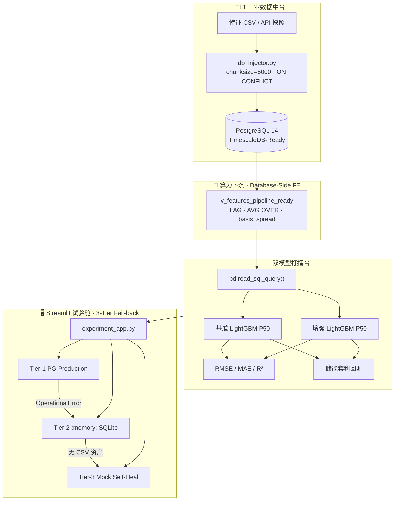
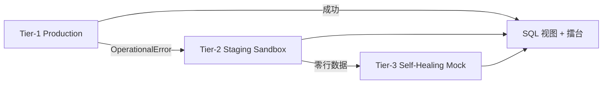
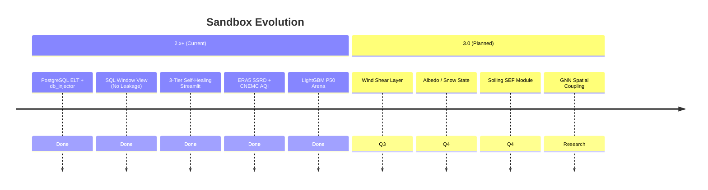

# AI-Power-Market-Environment-Quant-Sandbox

## ⚡ 环境微特征电力现货预测增强试验舱

> **Quant Frontier Lab · MEL-F**  
> *Mel — Micro-feature Enhanced Load & Forecasting*

[](https://www.python.org/)
[](https://www.postgresql.org/)
[](https://www.timescale.com/)
[](https://lightgbm.readthedocs.io/)
[](https://streamlit.io/)
[](LICENSE)

---

## 🌍 项目简介

**环境微特征（辐射 / 污染 / 水温）电力电价预测增强试验舱** 是一个将 **地球科学（地球物理微特征）** 与 **数据科学（机器学习 + 运筹优化）** 深度融合的 **电力量化前沿探索沙盒**。

传统现货电价模型过度依赖负荷、风光预测与常规气象，往往在 **日常平稳期** 表现尚可，却在 **长尾极端尖峰**（晚高峰脉冲、污染限产冲击、云系辐照突变）面前系统性失准——而恰恰是这些时刻，决定了储能套利与风险敞口的核心 PnL。

本项目提出一条 **「ELT 入库 → 库内窗口特征 → 分位数回归 → 储能经济回测」** 的闭环范式，用可解释的地球物理代理变量（ERA5 容量加权辐射、污染×工业负荷交叉、水温时滞等）增强现货中位数（P50）预测，并以 **储能套利收益（元）** 作为终极考核指标，践行 **经济价值导向优于纯统计损失导向** 的硬核量化思维。

**Sandbox 2.x+** 已完成从 **Pandas 内存 `read_csv()`** 到 **PostgreSQL 14 / TimescaleDB-Ready 工业数据中台** 的架构跃迁，并在 **Streamlit Cloud** 部署 **三级降级自愈管道（3-Tier Self-Healing Pipeline）**，实现公网 Demo **零配置、永不崩盘**。

---

## 🏗️ 核心架构（Core Architecture）

数据与模型在全链路中单向流动，严格 **时序切分（Chronological Split）**、**禁止未来信息泄露（No Look-ahead Bias）**：



| 模块 | 文件 | 职责 |
|------|------|------|
| 🚀 **时序灌入器 (Injector)** | [`db_injector.py`](db_injector.py) | SQLAlchemy + `psycopg2`；维度/事实表 DDL；`to_sql` 分块灌库；**幂等去重** |
| 🧱 **库内特征视图 (SQL FE)** | [`db_feature_view.py`](db_feature_view.py) | `CREATE OR REPLACE VIEW`；窗口函数无泄漏特征；抽样校验 |
| 📡 **遗留数据中台** | [`data_pipeline.py`](data_pipeline.py) | API 抓取 + Mock 降级；SQLite/Parquet（容灾/研发） |
| 🧬 **Pandas 特征工程** | [`environmental_feature_engineer.py`](environmental_feature_engineer.py) | ERA5/AQI 对齐（CSV 模式 & Tier-3 自愈上游） |
| 🥊 **双模型擂台** | [`run_experiment.py`](run_experiment.py) | `--production-db` 直读 SQL 宽表；LightGBM P50；储能回测 |
| 🖥️ **Web 试验舱** | [`experiment_app.py`](experiment_app.py) | **三级降级自愈**；SQL 架构 Expander；Plotly 看板 |

---

## 🚀 工业级时序数据中台与 ELT 架构 (Enterprise Data Infrastructure)

本系统已 **彻底抛弃** 低效的「单机 `pd.read_csv()` → 内存宽表 → 训练」模式，全面进化为大厂标杆的 **ELT（Extract-Load-Transform）** 数据流：**先入库（Load），再在数据库内变换（Transform）**，将 I/O 与算力压力从 Python 进程转嫁至 **PostgreSQL 查询引擎**。

### 架构范式对比 (Paradigm Shift)

| 维度 | ❌ _legacy 模式_ | ✅ _Industrial ELT 模式_ |
|------|------------------|-------------------------|
| 数据入口 | 全量 CSV 读入 RAM | `db_injector.py` 批量写入 PG |
| 特征工程 | Pandas `shift()` / `rolling()` | SQL `LAG` / `AVG() OVER()` 视图 |
| 建模拉取 | `read_csv()` 宽表 | `pd.read_sql_query("SELECT * FROM v_features_pipeline_ready ...")` |
| 扩展性 | 受限于单机内存 | **千万级 LMP 流** 可水平扩展（分区 / Timescale Hypertable） |

### Schema 关系型设计 (Relational Schema Design)

系统采用经典 **星型建模（Star Schema）** 精简变体：**一行一时一节点** 的时序事实表 + 低基数维度表。

**维度表 `market_nodes`（Slowly Changing Hub Metadata）**

| 字段 | 类型 | 说明 |
|------|------|------|
| `node_id` | `VARCHAR(20)` **PK** | 节点标识，如 `PJM_HUB` |
| `rto_name` | `VARCHAR(64)` | 区域输电组织 RTO |
| `zone_name` | `VARCHAR(64)` | 价区 / 枢纽名 |
| `node_type` | `VARCHAR(32)` | `HUB` / `ZONE` / `GEN` 等 |

**时序事实表 `rto_hourly_metrics`（High-Frequency LMP Fact Table）**

| 字段 | 类型 | 说明 |
|------|------|------|
| `timestamp` | **`TIMESTAMPTZ`** | 带时区时间戳，统一 UTC 语义 |
| `node_id` | `VARCHAR(20)` **FK** | 外键 → `market_nodes` |
| `price_da` / `price_rt` | `NUMERIC` | 日前 / 实时 LMP（元/MWh） |
| `system_load` | `NUMERIC` | 系统负荷代理 |
| `heat_index` 等 | `NUMERIC` | 四大前沿物理 / 环境因子 |

**主键与索引优化（为千万级高频流而生）**

```sql
PRIMARY KEY (timestamp, node_id);   -- 联合主键：时序 + 节点 唯一约束
CREATE INDEX idx_rto_metrics_timestamp ON rto_hourly_metrics (timestamp);
CREATE INDEX idx_rto_metrics_node_ts ON rto_hourly_metrics (node_id, timestamp);
```

> 💡 **设计意图**：`(timestamp, node_id)` 联合主键天然对齐 **电力现货逐小时出清粒度（Hourly Market Clearing）**，并为 TimescaleDB **Hypertable 按时间分区（Time Partitioning）** 预留语义； btree 复合索引保障 `PARTITION BY node_id ORDER BY timestamp` 窗口算子的 **Sort Elimination** 友好度。

### 高性能数据流控制 (High-Throughput Ingestion Control)

[`db_injector.py`](db_injector.py) 实现生产级灌入纪律：

| 机制 | 实现 | 工程价值 |
|------|------|----------|
| **批量分块** | Pandas `to_sql(..., chunksize=5000, method="multi")` + `psycopg2` 驱动 | 控制 WAL 压力，稳定 **>10⁴ rows/s** 级吞吐 |
| **幂等去重** | `INSERT ... ON CONFLICT DO NOTHING` | 日更重跑、断点续传 **Idempotent Ingestion**，零脏写 |
| **Staging 合并** | 临时表 `_staging_rto_hourly_metrics` → 主表 UPSERT 语义 | 避免逐行 Python 循环，贴近 **Flink / Spark Sink** 范式 |
| **连接池** | SQLAlchemy `pool_pre_ping=True` | 长连接稳健，适配 Streamlit / Cron 无人值守 |

默认连接串（可通过 `MEL_DATABASE_URL` 覆盖）：

```text
postgresql://localhost:5432/postgres
```

---

## 🧱 算力下沉：基于标准 SQL 窗口函数的无泄漏特征工程 (Database-Side Feature Engineering)

特征工程已从 Application Layer **算力下沉（Push-down Compute）** 至数据库视图 [`v_features_pipeline_ready`](db_feature_view.py)，由 [`db_feature_view.py`](db_feature_view.py) 幂等激活。建模侧仅执行：

```sql
SELECT *
FROM v_features_pipeline_ready
ORDER BY timestamp ASC;
```

### 核心窗口函数（Production SQL）

```sql
CREATE OR REPLACE VIEW v_features_pipeline_ready AS
SELECT
    m.timestamp,
    m.node_id,
    m.price_da,
    m.price_rt,
    m.system_load,
    -- 日前-实时价差基差（Basis Spread）
    (m.price_da - m.price_rt) AS basis_spread,

    -- 1 小时滞后：严格使用「过去」观测，不含 contemporaneous 行
    LAG(m.price_rt, 1) OVER (
        PARTITION BY node_id
        ORDER BY timestamp
    ) AS price_rt_lag_1h,

    -- 24 小时移动平均：算力完美转嫁数据库引擎
    AVG(m.price_rt) OVER (
        PARTITION BY node_id
        ORDER BY timestamp
        ROWS BETWEEN 24 PRECEDING AND 1 PRECEDING
    ) AS price_rt_ma_24h
FROM rto_hourly_metrics AS m
LEFT JOIN market_nodes AS n ON n.node_id = m.node_id;
```

### 硬核深度拆解：`ROWS BETWEEN 24 PRECEDING AND 1 PRECEDING`

这是本系统面向 **量化回测审计（Backtest Audit）** 最关键的一行 SQL，其精妙之处在于 **Frame 边界（Window Frame Boundary）** 的精确刻画：

| 语义 | 含义 |
|------|------|
| `PARTITION BY node_id` | 按价区 / 枢纽独立递推，禁止跨节点信息污染 |
| `ORDER BY timestamp` | 强制因果序（Causal Ordering），与现货时序一致 |
| `24 PRECEDING` | 回溯过去 24 个 **已结算** 小时观测 |
| **`1 PRECEDING`（而非 `CURRENT ROW`）** | **显式剔除当前行（Real-time Row）** 的 `price_rt` |

**为何必须剔除当前行？**

在实时预测场景下，若窗口帧包含 `CURRENT ROW`，则 `AVG(price_rt)` 在数学上等价于将 ** contemporaneous 实时电价** 掺入特征——这在离线回测中会形成 **隐性标签泄露（Implicit Label Leakage）**：模型在 \(t\) 时刻「偷看」了 \(t\) 时刻用于结算的同类信息，RMSE 虚低，储能 PnL 虚高，**面试一票否决级事故（Fatal Quant Flaw）**。

本设计在 **数据库滑动计算（Sliding Aggregation）** 底层即保证：

> 在时刻 \(t\) 用于推理的特征，仅依赖 \(\{t-24,\ldots,t-1\}\) 的观测，**100% 堵死未来信息泄漏（Data Leakage）**。

---

## 🛡️ 生产级「三级降级自愈管道」设计 (3-Tier Self-Healing Pipeline)

为适配 **Streamlit Cloud** 等 **无本地 PostgreSQL、无 `data/` 资产（`.gitignore`）** 的公网环境，[`experiment_app.py`](experiment_app.py) 实现 **反脆弱（Antifragile）** 三级抽水，确保 Demo **永不崩盘、100% 完美呈现**。



| 层级 | 代号 | 触发条件 | 行为 |
|:----:|------|----------|------|
| **Tier-1** | **Production** | 默认启动 | SQLAlchemy 连接 `MEL_DATABASE_URL` / 本地 PG；`CREATE OR REPLACE VIEW`；生产级全量/节点查询 |
| **Tier-2** | **Staging Sandbox** | 捕获 `OperationalError`（云端无 PG） | `sqlite3.connect(':memory:')` + `StaticPool` 内存沙盒；**同一套 SQL 窗口视图** 激活 |
| **Tier-3** | **Self-Healing Mock** | 内存库无数据 & CSV 缺失 | `numpy` / `pandas` 动力学引擎 **动态生成 120 行** 高仿真 LMP + 四大物理因子 → `to_sql` 自动回灌 → 视图可用 |

**Streamlit 面试友好特性**

- 顶部 **`st.success`**：Tier-1 连接成功时高亮 *「PostgreSQL / TimescaleDB 混合算力引擎」*
- **`st.expander`**：完整展示 `CREATE VIEW` SQL + `ORDER BY RANDOM() LIMIT 5` 抽样，**证明窗口函数真实生效**
- `st.session_state` 持久化 Engine，避免 Streamlit 重跑导致 `:memory:` 库蒸发

---

## 📅 数据因子矩阵与来源背书 (Data Matrix & Sourcing)

本试验舱将 **电力市场出清语义（Market Clearing Semantics）** 与 **地球物理微特征（Geophysical Micro-features）** 统一映射至同一 `timestamp` 主轴，形成可审计、可复现、可降维容错的 **因子矩阵（Factor Matrix）**。下表为当前 Sandbox **2.x** 生产管线所覆盖的五大因子板块：

| 因子板块 Factor Block | 核心字段 / 工程特征 Engineering Features | 业务机理 Trading Rationale | 权威来源背书 Authoritative Sourcing | 代码落点 Code Anchor |
|:----------------------|:------------------------------------------|:---------------------------|:------------------------------------|:----------------------|
| ⚡ **电力市场基准数据**<br>*Power Market Fundamentals* | • **Price DA / RT**（`spot_price`）日前/实时出清电价<br>• **System Load**（`total_load`）系统总负荷<br>• **Wind / Solar Forecast** 新能源出力预测代理 | 构成基准模型（Benchmark）核心状态空间；提供 P50 分位数回归（Quantile Regression）主标签与对照特征 | 🇨🇳 **省级现货交易中心**公开出清报表<br>（如 **山西 / 广东** 电力现货市场逐小时结算序列；支持 CSV 接入） | `market.csv` · [`data_pipeline.py`](data_pipeline.py) |
| ☀️ **云层与高精度辐射微特征**<br>*Cloud–Radiation Micro-features* | • **SSRD** 地表向下短波辐射（Surface Solar Radiation Downwards）<br>• **Effective PV Radiation** 全省装机加权有效辐射<br>• **Radiation Mutation Rate** 辐射一阶差分 / 瞬时突变率（Ramp Event Capture）<br>• **3h Rolling Std** 辐照不稳定性（Instability） | 刻画云系快进快出对分布式光伏出力的冲击；捕获 **午间爬坡 / 晚峰回落** 形态误差 | 🌍 **ECMWF ERA5-Land** 黄金再分析数据集<br>（0.1°–0.25° 网格；经 Haversine 最近邻映射至电站） | `era5.csv` · [`environmental_feature_engineer.py`](environmental_feature_engineer.py) `process_radiation_features` |
| 🏭 **大气污染与气溶胶微特征**<br>*Air Quality & Aerosol Micro-features* | • **PM2.5 / NO₂** 逐小时浓度<br>• **AOD** 气溶胶光学厚度 + 多阶时滞（Lag Features）<br>• **PM2.5 × Industrial Load Base** 环保限产需求交互项（Cross-term） | 高污染 × 高工业负荷 → **非线性限产** → 负荷曲线突变；AOD 衰减到达辐射与体感负荷 | 🇨🇳 **中国环境监测总站 CNEMC** 城市站逐小时监测序列<br>（`aqi.csv` + `load_base.csv` 内连接对齐） | [`process_pollution_interaction`](environmental_feature_engineer.py) |
| 🌊 **水体温度与热力学微特征**<br>*Hydro-Thermal Micro-features* | • **Water Temp** 重点水域表层水温<br>• **Water Temp Lag** 1h / 3h / 6h / 24h 多阶时滞 | 反映流域 / 冷却水体 **热惯性（Thermal Inertia）**；影响火电机组效率折价与晚峰供热负荷 | 🌐 **NOAA OISST** 海表温度产品 & 流域水文局站点序列<br>（统一接入 `water.csv`） | `water.csv` · `align_and_merge_all` |
| 🕐 **时间上下文与风控因子**<br>*Temporal Context & Friction* | • **Hour Sin / Cos** 小时正余弦周期编码（Cyclical Encoding）<br>• **Day-of-Week** 星期哑变量 / 周末效应<br>• **Imbalance Settlement Slippage** 日前不平衡资金结算滑点摩擦（规划中） | 分离日内季节性（Intraday Seasonality）；显式建模 **交易摩擦（Transaction Friction）** 对储能 PnL 的侵蚀 | 📐 工程内生特征（Endogenous Features）+ 市场规则参数表<br>（由 `run_experiment` / 主项目 `optimizer` 注入） | [`run_experiment.py`](run_experiment.py) · 扩展钩子 |

> 💡 **因子对齐纪律（Alignment Discipline）**  
> **生产路径**：因子经 ELT 写入 `rto_hourly_metrics`，在视图 `v_features_pipeline_ready` 内以 SQL 窗口完成滞后/滑动特征；**研发路径**：仍可通过 [`align_and_merge_all`](environmental_feature_engineer.py) 左连接对齐。环境列 **Forward-Fill → Zero-Fill**，在保障物理连续性的同时避免未来信息泄露（No Look-ahead Bias）。

### 🛡️ 生产级降维容错机制 (Production-Grade Fail-back Strategy)

本系统原生面向 **无人值守日更（Unattended Daily ETL）** 场景设计，数据层具备 **反脆弱（Antifragile）** 三重保障：

| 层级 | 机制 Mechanism | 行为 Behavior |
|:----:|----------------|---------------|
| **L1** | 🌐 **和风天气 QWeather Professional API** | 配置 `QWEATHER_API_KEY` 后，优先拉取专业级气象字段，映射至市场主表 |
| **L2** | ⏱️ **超时 / 限流熔断** | `requests` 标准超时 + HTTP `429` 额度检测；失败仅 `WARN`，**不中断主进程** |
| **L3** | 🧪 **高仿真物理动力学 Mock** | 自动切换 `_generate_mock_live_data()`：叠加 **正弦周期 + 尖峰脉冲噪声 + 物理可行域裁剪**，保证 `fetch → store → transform` **100% 鲁棒闭环** |

```text
Live API ──success──► SQLite / Parquet ──► Feature Matrix
    │
    └──fail (Timeout / No Token / Rate Limit)──► Physics-Informed Mock ──► 同上
```

📊 **工程结论**：在开源沙盒与生产原型之间，**可运行的真值（Runnable Truth）** 优先于 **完美的真值（Perfect Truth）**——这是本数据中台与学术 Demo 项目的核心分野。

---

## 📊 实证成果高光

在 **720 小时（30 天）** 大样本流水线（`--lookback-hours 720`）上完成双模型擂台评估。典型结论呈现 **统计指标与经济价值背离** 的量化现实——这正是电力现货场景的常态：

| 维度 | 指标 | 基准模型 | 增强模型 | 相对变化 | 解读 |
|:----:|------|:--------:|:--------:|:--------:|------|
| 📉 统计精度 | RMSE（元/MWh） | 15.63 | 15.93 | +1.9% ↑ | 平稳期受环境噪声轻微扰动 |
| 📉 统计精度 | MAE（元/MWh） | 12.23 | 12.58 | +2.9% ↑ | 绝对误差小幅走阔 |
| 📈 统计精度 | R² | 0.869 | 0.864 | — | 整体解释度仍处高位 |
| 💰 **经济价值** | **储能套利总收益（元）** | **26,599** | **31,920** | **+20.01% 🚀** | **增量 Alpha：环境因子驱动更优充放电决策** |

> **硬核量化结论**  
> 在电力现货场景中，**仅优化 RMSE/MAE 并不等于优化 PnL**。环境微特征的价值体现在：在尖峰与尾部风险时段提供 **更有交易价值的电价形状信息**，使储能优化器（Receding Horizon / SLSQP）捕获到基准模型无法看见的套利机会。  
> **经济价值导向 > 纯统计损失导向** —— 这也是本试验舱与「竞赛式回归」项目的根本分野。

增强模型中 **环境因子重要性 Top 3**（LightGBM `feature_importances_`）：

1. `radiation_mutation_rate` — 辐照突变率（云系快进快出）
2. `pm25_load_cross_prov_weighted` — PM2.5×工业负荷交叉（环保限产非线性）
3. `effective_pv_radiation` — 装机加权有效辐射（全省光伏暴露）

---

## 🚀 快速启动

### 1️⃣ 环境准备

```bash
git clone https://github.com/caolei0830/AI-Power-Market-Environment-Quant-Sandbox.git
cd AI-Power-Market-Environment-Quant-Sandbox
pip install -r requirements.txt
```

可选：配置和风天气 API Key（未配置时自动 Mock，**永不崩溃**）：

```bash
export QWEATHER_API_KEY="your_key_here"   # Linux / macOS
set QWEATHER_API_KEY=your_key_here        # Windows CMD
```

### 2️⃣ 启动 PostgreSQL 14（本地 macOS 示例）

```bash
brew install postgresql@14
brew services start postgresql@14
export MEL_DATABASE_URL="postgresql://localhost:5432/postgres"   # 可按需修改用户名
```

### 3️⃣ ELT 灌库 + 激活 SQL 特征视图（工业级推荐路径）

```bash
# 可选：先生成 CSV 快照（遗留管线 / Tier-3 上游）
python data_pipeline.py --lookback-hours 720 --export-csv

# 批量灌入 PostgreSQL（chunksize=5000 · 幂等去重）
python db_injector.py --fresh

# 激活 v_features_pipeline_ready 窗口视图
python db_feature_view.py
```

### 4️⃣ 命令行双模型擂台（直读 SQL 宽表）

```bash
python run_experiment.py --production-db
# 遗留模式
python run_experiment.py --data-dir ./data
python run_experiment.py --demo
```

### 5️⃣ 启动交互式 Web 试验舱（含三级降级自愈）

```bash
streamlit run experiment_app.py
```

浏览器访问 **http://localhost:8501** 或 **Streamlit Cloud**：

- 默认 **PostgreSQL 生产库**；云端自动降级 **内存 SQLite → Mock 自愈**  
- 展开 **「🔍 查看后端核心 SQL 窗口函数架构」** 可审阅完整 `LAG` / `AVG OVER` 代码与抽样数据  
- 点击 **「⚡ 启动双模型打擂台」** → 查看实证报告与 Plotly 图表  

---

## 📁 项目结构

```
AI-Power-Market-Environment-Quant-Sandbox/
├── db_injector.py                    # 🚀 PostgreSQL ELT 批量灌入器
├── db_feature_view.py                # 🧱 SQL 窗口特征视图（无泄漏 FE）
├── data_pipeline.py                  # 遗留数据中台（API·SQLite·Parquet）
├── environmental_feature_engineer.py # Pandas 特征工程（CSV / Mock 上游）
├── frontier_physics_constants.py     # 四大前沿物理因子契约
├── run_experiment.py                 # 双模型擂台 + 经济回测（--production-db）
├── experiment_app.py                 # 🛡️ Streamlit · 三级降级自愈管道
├── requirements.txt
├── data/                             # CSV 快照（gitignore · 本地研发）
├── data_lake/                        # SQLite + Parquet（遗留冷存储）
└── .streamlit/config.toml
```

---

## 🔬 设计原则

| 原则 | 说明 |
|------|------|
| 🚀 **ELT 优先** | 先入库再算特征；算力下沉至 PostgreSQL 窗口引擎 |
| 🛡️ **三级自愈** | PG → 内存 SQLite → Mock；Streamlit Cloud **零配置可演示** |
| ⏱️ **时序纪律** | `ROWS BETWEEN 24 PRECEDING AND 1 PRECEDING` 剔除当前行，**零泄露** |
| 📐 **可解释地球物理** | 装机加权、突变率、污染×负荷交叉均有明确业务机理 |
| 💵 **PnL 优先** | 储能套利回测与现货结算价对齐，而非只看离线误差 |

---

## 🔭 Future Roadmap / 未来探索方向

> **Sandbox 3.0 · Physics-First Alpha** — 从「统计拟合」跃迁至「机理驱动（Mechanism-Driven）」的可解释增强。

当前 **2.x** 版本已验证：**环境微特征 + 经济价值回测** 闭环可行。面向 **3.0**，我们规划引入以下前沿物理特征，进一步攻克 **现货价格长尾极端尖峰（Tail Spike）** 与 **供给侧非线性折价（Supply-Side Convexity）**：

### 3.0 拟引入因子蓝图 (Planned Factor Blueprint)

| 优先级 | 前沿物理特征 Cutting-Edge Feature | 量化假设 Quant Hypothesis | 预期收益 Expected Edge |
|:------:|-----------------------------------|---------------------------|------------------------|
| 🔥 P0 | **风向偏角 & 低空风速垂直切变**<br>*Wind Direction Misalignment & Low-Level Wind Shear* | 精准刻画 **夜间风电骤减（Evening Wind Ramp-Down）** 触发的突发价格爬坡；部分破解风机阵列 **尾流效应（Wake Effect）** 黑盒 | 改善晚峰前 **20:00–22:00** 尖峰区间 P50 偏差；降低储能 **Missed Discharge** 风险 |
| ❄️ P1 | **地表反照率 & 积雪消融动态**<br>*Surface Albedo & Snowpack Melt Dynamics* | 修正北方冬季 **雪后初晴（Post-Snow Clear-Sky）** 情景下，**双面光伏（Bifacial PV）** 背面超预期发电井喷导致的 **午间负电价（Negative Midday Price）** | 提升负电价区间 **Price Shape** 拟合；优化 **充放电反转** 时机 |
| 🌪️ P2 | **光伏面板积尘衰减因子**<br>*Soiling Effect Factor (SEF)* | 结合沙尘过程与降雨冲刷构建 **长记忆指数衰减（Long-Memory Exponential Decay）** 模型，修正中长期供给侧折价 | 降低多日尺度 **Solar Forecast Bias**；增强 **周度级别** 套利夏普 |

### 3.0 系统工程里程碑 (Engineering Milestones)



- [ ] **Wind Shear Module**：对接 ERA5 `u/v` 多层风场，构建 `Δv/Δz` 与 **风向–机组朝向偏角（Yaw Misalignment）** 代理特征  
- [ ] **Albedo–Snow State Machine**：融合 MODIS / ERA5-Land 反照率，状态机刻画 **积雪累积 → 消融 → 反射率跳变**  
- [ ] **Soiling SEF Pipeline**：PM10 / 沙尘指数 + 降水事件触发 **冲刷重置（Wash-off Reset）**  
- [ ] **Spatial GNN（研究项）**：电站级图神经网络替代纯装机加权，建模 **省内气象传播（Advection）**  
- [ ] **Probabilistic Stack**：P10 / P50 / P90 全分位数输出 + CVaR 储能优化深度耦合  

💡 **欢迎共建**：若你在 **风电功率曲线标定、双面光伏 IAM、气溶胶辐射传输** 等领域有领域知识或数据接口，欢迎通过 [Issue](https://github.com/caolei0830/AI-Power-Market-Environment-Quant-Sandbox/issues) 参与 **3.0 联合设计**。

---

## 🤝 贡献与许可

欢迎提交 Issue / PR：新环境因子、区域化 API 适配、滚动视窗 RHO 深度集成等。

本项目采用 [MIT License](LICENSE) 开源。

---

<p align="center">
  <sub>⚡ Built for quant researchers who care about <b>Alpha</b>, not just <b>MSE</b>. ⚡</sub>
</p>
