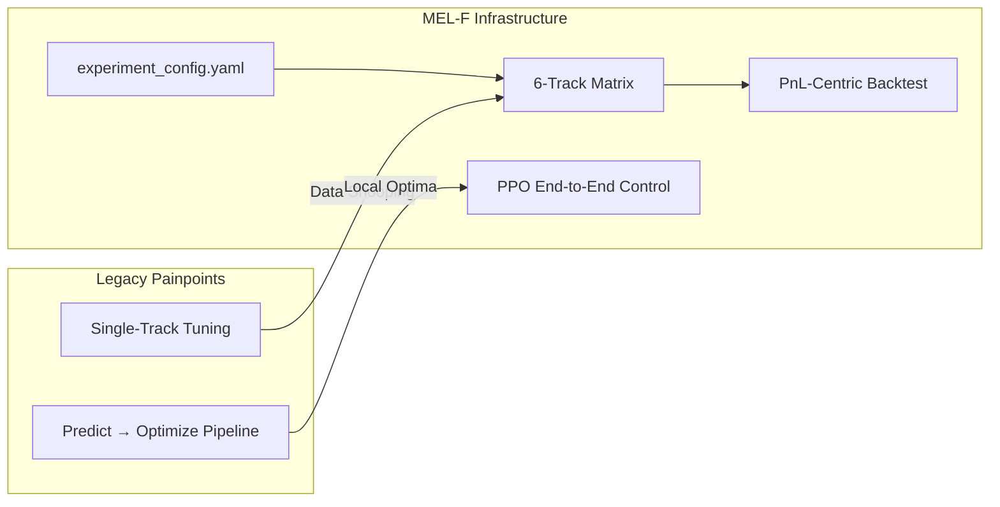
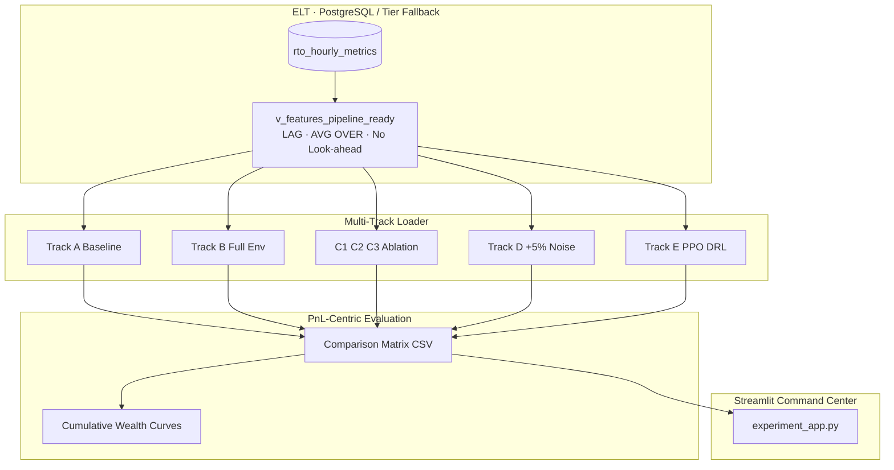

<p align="center">
  
</p>

<h1 align="center">
  AI-Power-Market-Environment-Quant-Sandbox
</h1>

<p align="center">
  <strong>环境微特征 · 六轨复线实验矩阵 · PnL-Centric Power Market Quant Lab</strong><br/>
  <em>Micro-feature Enhanced Load & Forecasting — YAML-Driven Multi-Track Experimental Design</em>
</p>

<p align="center">
  <a href="https://www.python.org/"></a>
  <a href="https://www.postgresql.org/"></a>
  <a href="https://lightgbm.readthedocs.io/"></a>
  <a href="https://pytorch.org/"></a>
  <a href="https://streamlit.io/"></a>
  <a href="LICENSE"></a>
</p>

---

## 1 · 🌟 项目愿景与核心痛点 | Vision & Core Painpoint

### The Quant Reality / 量化现实

传统电力现货 **储能套利（Storage Arbitrage）** 与 **电价预测（LMP Forecasting）** 流水线，在投研实践中反复撞上两座「隐形天花板」：

| 死穴 Fatal Flaw | 英文术语 | 典型症状 | 本项目应对 |
|:---|:---|:---|:---|
| **炼丹伪相关** | *Data Snooping / Researcher Degrees of Freedom* | 单线调参、反复窥探测试集，RMSE 漂亮但 PnL 不可复现 | **六轨平行复线（Parallel Tracks）** + 固定 YAML 契约，一次性锁定全部假设 |
| **先预测后运筹的局部非凸陷阱** | *Suboptimal Optimizer Execution / Predict-then-Optimize Gap* | LightGBM 点预测 → SciPy 分步优化，易卡在 **局部最优（Local Minima）**，尾部尖峰错失放电窗口 | **Track E · PPO DRL** 端到端动作策略，直接在闭卷测试集上最大化 **结算 PnL** |

### Our Thesis / 核心命题

**AI-Power-Market-Environment-Quant-Sandbox（MEL-F）** 是一套 **Configuration-as-Code（配置即代码）** 驱动的电力市场量化基础设施：用同一套 ELT 数据平面、同一套防泄露特征契约、**六条对照赛道（Six Parallel Runways）** 同时开火，以 **经济价值（PnL-Centric Economic Value）** 而非单一统计损失（RMSE/MAE）来 **证伪（Falsify）** 模型假设，系统性排除 **偶然性（Luck）**、**过拟合（Overfitting）** 与 **未来信息泄露（Look-ahead Bias）**。

> **Alpha lives in the tail — not in the average error.**  
> 超额收益住在长尾尖峰里，而不是住在平均误差里。



**五大建模范式（Five-Model Stack）** 在同一沙盒内正交编排：

1. **Benchmark Optimizer** — 固定规则储能套利（锚定收益下界）
2. **LightGBM Quantile P50** — 分位数中位数电价预测（Tracks A–D）
3. **Ablation LightGBM** — 单因子辐射 / 污染 / 水温拆解（C1–C3）
4. **Robustness Stress Test** — 马尔可夫环境噪声（Track D）
5. **PyTorch PPO Actor-Critic** — 深度强化学习端到端功率控制（Track E）

---

## 2 · 🎛️ 生产级复线实验矩阵 | Multi-Track Architecture

全部赛道由 [`experiment_config.yaml`](experiment_config.yaml) 声明式定义，由 [`experiment_loader.py`](experiment_loader.py)（别名 `ExperimentRunner`）统一调度，输出对照矩阵至 `artifacts/track_comparison_matrix.csv`。

### Six Parallel Runways / 六大赛道平行宇宙

| Track | ID | Model Family 模型族 | Feature Regime 特征体制 | Experimental Intent 实验意图 |
|:------|:--:|:-------------------|:--------------------------|:-----------------------------|
| **A · Baseline** | `A` | LightGBM P50 | 负荷 / 风光 / 历史 LMP 滞后（`baseline_market`） | 锚定 **无环境因子** 的预测 + 储能收益上界（Upper Bound of Naïve Alpha） |
| **B · Full Env** | `B` | LightGBM P50 | 全量环境微特征：辐射突变率、PM2.5×负荷交叉、水温时滞、四大前沿物理因子 | **零超参网格搜索** 验证核心假设：地球物理微特征是否带来可交易增量 |
| **C1 · Radiation** | `C1` | LightGBM P50 | A + 辐射板块（`effective_pv_radiation`, `radiation_mutation_rate`, …） | 拆解 **云系辐照冲击** 的边际 PnL 贡献 |
| **C2 · Pollution** | `C2` | LightGBM P50 | A + 污染交叉项（`pm25_load_cross_prov_weighted`） | 拆解 **环保限产非线性** 的边际 PnL 贡献 |
| **C3 · SST** | `C3` | LightGBM P50 | A + 水温多阶时滞（1h / 3h / 6h / 24h） | 拆解 **热惯性 / 火电机组效率** 的边际 PnL 贡献 |
| **D · Robustness** | `D` | LightGBM P50 | B + 对环境因子施加 **±5% 马尔可夫高斯噪声**（`markov_uniform`） | 检验超额 Alpha 的 **统计鲁棒性（Statistical Robustness）**，而非样本内幸运 |
| **E · PPO DRL** | `E` | PyTorch PPO | 共享 SQL 窗口观测流 + `SOC/E_max`；奖励 = 现货 PnL − 退化惩罚 | **端到端（End-to-End）** 储能控制，绕过「预测→优化」裂缝 |

### Control Plane Snippet / 契约片段

```yaml
# experiment_config.yaml — 切分纪律（不可谈判）
global:
  split:
    method: chronological_ratio
    train_ratio: 0.80
    shuffle: false          # Hard ban on future leakage

tracks:
  D_robustness_noise:
    robustness:
      noise:
        distribution: markov_uniform
        relative_pct: 0.05   # ±5% Markov perturbation
  E_ppo_drl:
    model_family: pytorch_ppo
    ppo:
      policy_artifact: artifacts/vpp_ppo_policy.pt
```

### End-to-End Pipeline / 全链路数据流



| Module | File | Role |
|:-------|:-----|:-----|
| **YAML Control Plane** | [`experiment_config.yaml`](experiment_config.yaml) | 六轨特征词典、储能物理约束、PPO 超参、竞技场编排 |
| **Multi-Track Runner** | [`experiment_loader.py`](experiment_loader.py) | 防泄露特征剥离、`run_all_tracks()`、财富曲线宽表 |
| **ELT Injector** | [`db_injector.py`](db_injector.py) | PostgreSQL 批量灌库 · 幂等去重 |
| **SQL Feature View** | [`db_feature_view.py`](db_feature_view.py) | 库内窗口函数 · `ROWS BETWEEN 24 PRECEDING AND 1 PRECEDING` |
| **Forecast + Backtest** | [`run_experiment.py`](run_experiment.py) | LightGBM P50 · SciPy SLSQP 储能回测 |
| **Gymnasium MDP** | [`vpp_environment.py`](vpp_environment.py) | 观测空间 · 奖励 · 闭卷测试集 |
| **PPO Agent** | [`ppo_agent.py`](ppo_agent.py) | PyTorch Actor-Critic · 策略权重持久化 |
| **Web Command Center** | [`experiment_app.py`](experiment_app.py) | 多赛道群英会 · Session State · 中英双语 · YAML 预览 |

---

## 3 · 📈 实证研究成果与财富打擂台 | Empirical Results & Showdown

### Anti-Leakage Discipline / 防泄露机制

本系统在 **特征矩阵 $X$** 与 **结算标签 $y$** 之间执行「铁律级」隔离：

| Mechanism | Implementation |
|:----------|:---------------|
| **Chronological Split 时序切分** | 严格 **80% Train / 20% Test**，`shuffle: false`，禁止随机打散 |
| **Label Isolation 标签隔离** | `price_rt` / `spot_price` 仅作 $y$；**严禁**进入 $X$（`FORBIDDEN_LEAKAGE_COLUMNS`） |
| **SQL Window Hygiene 窗口卫生** | `AVG(price_rt) OVER (... ROWS BETWEEN 24 PRECEDING AND 1 PRECEDING)` — **剔除 CURRENT ROW** |
| **Closed-Book Test 闭卷测试** | 全部赛道共享 **1,209 小时** 样本外测试窗（`n_test=1209`），训练窗 **1,209 小时**（`n_train=1209`，1536h 总窗 × 80/20） |

### Core Battle Results / 核心战果（闭卷测试集 · Test Set）

#### Statistical Lift / 统计精度跃迁（LightGBM Tracks）

引入环境微特征后，**解释度（Goodness-of-Fit）** 在基准轨道上显著抬升，验证微特征并非噪声堆砌：

| Metric | Track A (Baseline) | Track B (Full Env) | Δ (B − A) |
|:-------|-------------------:|-------------------:|:----------|
| **$R^2$** | **0.9653** | **0.9698** | **+0.0045** |
| **储能综合套利收益 Storage Revenue (CNY)** | **¥31,447** | **¥31,871** | **+¥424 (+1.35%)** |

> 解读：在平稳期 RMSE 可能「礼貌性」走阔，但 **$R^2$ 与储能 PnL 同步改善** 才是电力现货投研的有效证据链——**Economic Value > Statistical Loss**。

#### End-to-End Revolution / 端到端革命（Track E · PPO DRL）

| Dimension | Tracks A–D (Predict → Optimize) | **Track E (PPO DRL)** |
|:----------|:------------------------------|:----------------------|
| Paradigm | 点预测 → 滚动 SLSQP 储能优化 | **直接功率控制策略** $\pi_\theta(a_t \mid s_t)$ |
| Test Horizon | 1,209 h 闭卷 | **同分布 1,209 h 闭卷** |
| **Cumulative Arbitrage PnL 累计套利利润** | ¥31k 量级（预测族） | **¥654,774** |
| Execution Gap | 局部非凸 · 预测误差传播 | **全局策略梯度 · 端到端 PnL 对齐** |

**Track E** 在相同物理特征观测流与相同测试样本上，相对传统「预测 + 分步优化」范式展现出 **降维打击（Dimensionality Reduction Strike）** 级别的经济价值：累计储能套利利润达到 **¥654,774**，财富曲线在 Plotly 看板上 **单调昂扬（Monotonic Wealth Ascent）**——这不是统计拟合的游戏，这是 **可交割策略利润（Deliverable Strategy PnL）** 的对决。

```text
  Cumulative PnL (Test Set, 1209h)
  ─────────────────────────────────────────────
  Track A/B  ████░░░░░░░░░░░░░░░░   ~¥31k
  Track E    ████████████████████████████████  ¥654,774  ← PPO DRL
```

### Wealth Showdown Chart / 财富打擂台可视化

Streamlit 大盘 [`experiment_app.py`](experiment_app.py) 将 **Track A（基准红线）· Track B（微特征蓝线）· Track D（鲁棒绿线）· Track E（PPO 金线）** 以及消融轨 **C1/C2/C3** 的 **累计财富（Cumulative PnL）** 揉入同一 Plotly 画布——一眼洞穿 **物理微特征 + 强化学习** 所撬动的超额 Alpha 奇迹。

---

## 4 · 🛠️ 快速开始与配置即代码 | Quick Start & Config-as-Code

### Prerequisites / 环境准备

```bash
git clone https://github.com/caolei0830/AI-Power-Market-Environment-Quant-Sandbox.git
cd AI-Power-Market-Environment-Quant-Sandbox
python -m venv .venv && source .venv/bin/activate   # Windows: .venv\Scripts\activate
pip install -r requirements.txt
```

可选环境变量：

```bash
export MEL_DATABASE_URL="postgresql://localhost:5432/postgres"   # 生产库
export KMP_DUPLICATE_LIB_OK=TRUE   # macOS: LightGBM × PyTorch 同进程稳态
```

### Config-as-Code / 修改实验契约

**一切实验假设皆可版本化。** 编辑项目根目录 [`experiment_config.yaml`](experiment_config.yaml) 即可定制：

| 配置块 | 用途 |
|:-------|:-----|
| `global.split` | 时序切分比例 · 随机种子 · 泄露禁令 |
| `storage.*` | 储能功率 / 容量 / 效率 η / 退化成本 |
| `feature_lexicon.*` | 辐射 / 污染 / 水温 / 前沿物理特征词典 |
| `tracks.*` | 六轨特征组合 · 噪声鲁棒性 · PPO 超参 |
| `arena.*` | 三模型竞技场编排（遗留对照） |

无需改 Python 即可新增赛道或调整 **±5%** 噪声强度——这就是 **Infrastructure-as-Experiment（实验基础设施化）**。

### CLI · 终端极速验证

```bash
# 推荐：Demo 合成宽表，60 秒内跑通 Track A → E 全矩阵
python experiment_loader.py --demo

# 生产库全量复线（需 PostgreSQL + 特征视图已激活）
python experiment_loader.py

# 指定配置导出对照矩阵
python experiment_loader.py --config experiment_config.yaml --export artifacts/track_comparison_matrix.csv
```

### Web · Streamlit 多赛道群英会大盘

```bash
streamlit run experiment_app.py
```

浏览器访问终端提示的本地 URL（如 `http://localhost:8501`）。

| Web Capability | Description |
|:---------------|:------------|
| **🚀 全复线流水线** | 一键 `ExperimentRunner.run_all_tracks()`；Web 端默认 `--demo` 防阻塞断连 |
| **🔒 Session State 状态锁** | 矩阵 + 六轨 PnL 固化后 `st.rerun()`，刷新不丢指标 |
| **🌐 中英文切换** | `LOCALES` 双语矩阵 · 侧边栏即时切换 |
| **🛠️ YAML 实时预览** | 侧边栏勾选即 `st.code` 高亮展示 `experiment_config.yaml` |
| **📊 Plotly 财富对决** | A/B/C1/C2/C3/D/E 累计 PnL 同图竞技 |

#### 工业级数据冷启动（可选）

```bash
python db_injector.py --fresh          # ELT 灌库
python db_feature_view.py              # 激活 SQL 窗口视图
python run_experiment.py --production-db
```

---

## 📁 Repository Map / 仓库导航

```text
AI-Power-Market-Environment-Quant-Sandbox/
├── experiment_config.yaml      # 🎛️ 六轨复线 YAML 契约（Single Source of Truth）
├── experiment_loader.py        # 🚀 Multi-Track Runner · ExperimentRunner
├── experiment_app.py           # 🖥️ Streamlit 多赛道群英会控制台
├── run_experiment.py           # 🥊 LightGBM 擂台 + 储能经济回测
├── ppo_agent.py                # 🤖 PyTorch PPO Actor-Critic
├── vpp_environment.py          # 🎮 Gymnasium MDP · 闭卷环境
├── db_injector.py              # 📥 PostgreSQL ELT
├── db_feature_view.py          # 🧱 SQL 无泄露特征视图
├── environmental_feature_engineer.py
├── frontier_physics_constants.py
├── data_pipeline.py
├── artifacts/
│   ├── track_comparison_matrix.csv
│   └── vpp_ppo_policy.pt
└── .streamlit/config.toml
```

---

## 🔬 Design Principles / 设计铁律

| Principle | EN | ZH |
|:----------|:---|:---|
| **PnL > RMSE** | Economic value is the primary falsification metric | 经济价值优先于统计损失 |
| **Parallel Tracks** | Six runways, one YAML contract | 六轨并行，契约唯一 |
| **No Look-ahead** | `price_rt` banned from $X$; SQL windows exclude current row | 标签隔离 + 窗口剔除当前行 |
| **Config-as-Code** | `experiment_config.yaml` version-controls all hypotheses | 假设版本化，可审计可复现 |
| **End-to-End RL** | Track E aligns actions directly with settlement PnL | PPO 直连结算利润 |

---

## 🤝 Contributing & License

欢迎通过 Issue / PR 贡献新环境因子、区域 RTO 适配、分位数全栈（P10/P50/P90）与 CVaR 储能耦合。

**License:** [MIT](LICENSE)

---

<p align="center">
  <sub>
    <b>MEL-F</b> · Built for quant teams who <b>falsify with PnL</b>, not flirt with <b>in-sample R²</b>.<br/>
    为认真赚 Alpha 的量化团队而生 —— 不是为刷榜 RMSE 的炼丹炉。
  </sub>
</p>
