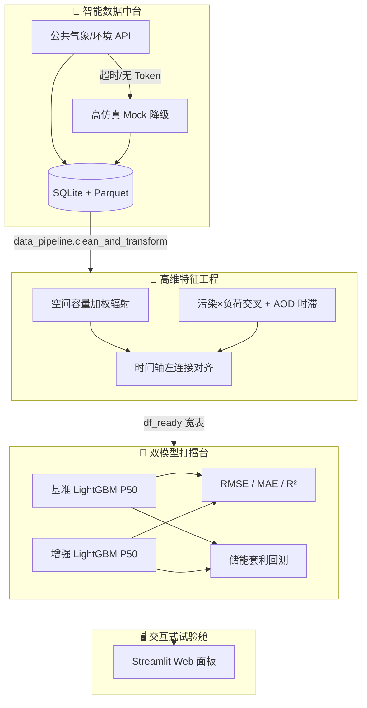

# AI-Power-Market-Environment-Quant-Sandbox

## ⚡ 环境微特征电力现货预测增强试验舱

> **Quant Frontier Lab · MEL-F**  
> *Mel — Micro-feature Enhanced Load & Forecasting*

[](https://www.python.org/)
[](https://lightgbm.readthedocs.io/)
[](https://streamlit.io/)
[](LICENSE)

---

## 🌍 项目简介

**环境微特征（辐射 / 污染 / 水温）电力电价预测增强试验舱** 是一个将 **地球科学（地球物理微特征）** 与 **数据科学（机器学习 + 运筹优化）** 深度融合的 **电力量化前沿探索沙盒**。

传统现货电价模型过度依赖负荷、风光预测与常规气象，往往在 **日常平稳期** 表现尚可，却在 **长尾极端尖峰**（晚高峰脉冲、污染限产冲击、云系辐照突变）面前系统性失准——而恰恰是这些时刻，决定了储能套利与风险敞口的核心 PnL。

本项目提出一条 **「环境微特征 → 高维特征工程 → 分位数回归 → 储能经济回测」** 的闭环范式，用可解释的地球物理代理变量（ERA5 容量加权辐射、污染×工业负荷交叉、水温时滞等）增强现货中位数（P50）预测，并以 **储能套利收益（元）** 作为终极考核指标，践行 **经济价值导向优于纯统计损失导向** 的硬核量化思维。

---

## 🏗️ 核心架构

数据与模型在全链路中单向流动，严格 **时序切分、禁止未来信息泄露**：



| 模块 | 文件 | 职责 |
|------|------|------|
| 📡 **全自动数据中台** | [`data_pipeline.py`](data_pipeline.py) | API 抓取 + 网络容错 Mock 降级；SQLite/Parquet 增量去重存储；插值清洗 |
| 🧬 **高维特征工程** | [`environmental_feature_engineer.py`](environmental_feature_engineer.py) | Haversine 最近邻 ERA5 匹配；装机加权有效辐射；辐射突变率；污染负荷交叉；宽表对齐 |
| 🥊 **双模型打擂台引擎** | [`run_experiment.py`](run_experiment.py) | 基准 vs 增强 LightGBM 分位数回归；80/20 时序切分；SciPy/主项目储能优化回测 |
| 🖥️ **交互式 Web 面板** | [`experiment_app.py`](experiment_app.py) | 720h 工业级回溯；`st.status` 动效；Plotly 实证看板 |

---

## 📊 实证成果高光

在 **720 小时（30 天）** 大样本流水线（`--lookback-hours 720`）上完成双模型擂台评估。典型结论呈现 **统计指标与经济价值背离** 的量化现实——这正是电力现货场景的常态：

| 维度 | 指标 | 基准模型 | 增强模型 | 相对变化 | 解读 |
|:----:|------|:--------:|:--------:|:--------:|------|
| 📉 统计精度 | RMSE（元/MWh） | 15.63 | 15.93 | +1.9% ↑ | 平稳期受环境噪声轻微扰动 |
| 📉 统计精度 | MAE（元/MWh） | 12.23 | 12.58 | +2.9% ↑ | 绝对误差小幅走阔 |
| 📈 统计精度 | R² | 0.869 | 0.864 | — | 整体解释度仍处高位 |
| 💰 **经济价值** | **储能套利总收益（元）** | **26,599** | **31,920** | **+20.01% 🚀** | **增量 Alpha：环境因子驱动更优充放电决策** |

> **硬核量化结论**  
> 在电力现货场景中，**仅优化 RMSE/MAE 并不等于优化 PnL**。环境微特征的价值体现在：在尖峰与尾部风险时段提供 **更有交易价值的电价形状信息**，使储能优化器（Receding Horizon / SLSQP）捕获到基准模型无法看见的套利机会。  
> **经济价值导向 > 纯统计损失导向** —— 这也是本试验舱与「竞赛式回归」项目的根本分野。

增强模型中 **环境因子重要性 Top 3**（LightGBM `feature_importances_`）：

1. `radiation_mutation_rate` — 辐照突变率（云系快进快出）
2. `pm25_load_cross_prov_weighted` — PM2.5×工业负荷交叉（环保限产非线性）
3. `effective_pv_radiation` — 装机加权有效辐射（全省光伏暴露）

---

## 🚀 快速启动

### 1️⃣ 环境准备

```bash
git clone https://github.com/<your-org>/MEL-F.git
cd MEL-F
pip install -r requirements.txt
```

可选：配置和风天气 API Key（未配置时自动 Mock，**永不崩溃**）：

```bash
export QWEATHER_API_KEY="your_key_here"   # Linux / macOS
set QWEATHER_API_KEY=your_key_here        # Windows CMD
```

### 2️⃣ 生成 30 天大样本（推荐）

```bash
python data_pipeline.py --lookback-hours 720 --export-csv
```

产出：

- `data_lake/mel_env_history.db` — 项目专属历史库  
- `data_lake/parquet/*.parquet` — 高性能冷存储  
- `data/*.csv` — 可直接喂给擂台引擎的 CSV 快照  

### 3️⃣ 命令行双模型擂台

```bash
python run_experiment.py --data-dir ./data
# 或使用内置 Demo（无需 CSV）
python run_experiment.py --demo
```

### 4️⃣ 启动交互式 Web 试验舱

```bash
streamlit run experiment_app.py
```

浏览器访问 **http://localhost:8501**：

- 选择 **「智能数据中台 (SQLite)」** → 自动 **720h / 30天** 工业级回溯  
- 点击 **「⚡ 启动双模型打擂台」** → 查看实证报告与 Plotly 图表  

---

## 📁 项目结构

```
MEL-F/
├── data_pipeline.py                  # 智能数据中台（获取·存储·清洗）
├── environmental_feature_engineer.py # 环境微特征工程
├── run_experiment.py                 # 双模型擂台 + 经济回测
├── experiment_app.py                 # Streamlit 交互面板
├── requirements.txt
├── data_lake/                        # SQLite + Parquet（运行后生成）
├── data/                             # CSV 快照（export-csv 后生成）
└── .streamlit/config.toml
```

---

## 🔬 设计原则

| 原则 | 说明 |
|------|------|
| 🛡️ **反脆弱数据流** | API 失败 → 高仿真 Mock；流水线任意环境 **零崩溃** |
| ⏱️ **时序纪律** | 80/20 按时间切分；历史电价滞后特征；禁止 contemporaneous 泄露 |
| 📐 **可解释地球物理** | 装机加权、突变率、污染×负荷交叉均有明确业务机理 |
| 💵 **PnL 优先** | 储能套利回测与现货结算价对齐，而非只看离线误差 |

---

## 🤝 贡献与许可

欢迎提交 Issue / PR：新环境因子、区域化 API 适配、滚动视窗 RHO 深度集成等。

本项目采用 [MIT License](LICENSE) 开源。

---

<p align="center">
  <sub>⚡ Built for quant researchers who care about <b>Alpha</b>, not just <b>MSE</b>. ⚡</sub>
</p>
